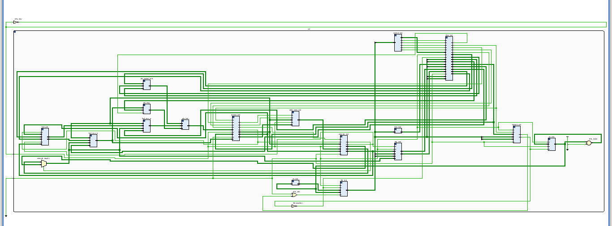
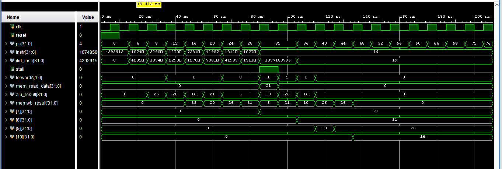

# 5-Stage Pipelined RISC-V Processor

A 5-stage pipelined RISC-V processor implemented in **Verilog HDL** featuring instruction pipelining, pipeline registers, data forwarding, and hazard detection. The processor improves instruction throughput while correctly handling data hazards using forwarding and stalling mechanisms.

---

## 📖 Project Overview

This project converts a basic single-cycle RISC-V processor into a **5-stage pipelined architecture**. By dividing instruction execution into multiple stages, several instructions can execute simultaneously, significantly improving processor performance and utilization.

The implementation includes:

- 5-stage RISC-V pipeline
- Pipeline registers
- Forwarding Unit
- Hazard Detection Unit
- Data Memory
- Register File
- ALU and Control Logic
- Verilog HDL implementation
- Simulation and testing

---

## 🚀 Pipeline Stages

The processor consists of the following pipeline stages:

### 1. Instruction Fetch (IF)
- Fetches instructions from Instruction Memory
- Uses the Program Counter (PC)
- Computes the next instruction address (PC + 4)

### 2. Instruction Decode (ID)
- Decodes fetched instruction
- Reads operands from Register File
- Generates immediate values
- Generates control signals

### 3. Execute (EX)
- Performs arithmetic and logical operations
- Calculates memory addresses
- Executes branch comparisons
- Uses forwarded operands when required

### 4. Memory Access (MEM)
- Performs load and store operations
- Reads from or writes to Data Memory

### 5. Write Back (WB)
- Writes ALU or memory results back to the Register File

---

## 📦 Pipeline Registers

To enable pipelining, registers are inserted between adjacent stages.

- IF/ID
- ID/EX
- EX/MEM
- MEM/WB

These registers store instruction data and control signals for the next clock cycle.

---

## 🏗️ Processor Components

The datapath contains:

- Program Counter (PC)
- Instruction Memory
- Register File (32 × 32-bit)
- Immediate Generator
- Control Unit
- ALU
- ALU Control
- ALU Operand Multiplexer
- Data Memory
- Write Back Multiplexer
- Forwarding Unit
- Hazard Detection Unit
- Pipeline Registers

---

## ⚡ Forwarding Unit

The forwarding unit minimizes pipeline stalls caused by data hazards.

### Inputs

- ID/EX.rs1
- ID/EX.rs2
- EX/MEM.rd
- EX/MEM.RegWrite
- MEM/WB.rd
- MEM/WB.RegWrite

### Outputs

- ForwardA
- ForwardB

### Forwarding Paths

- EX/MEM → EX
- MEM/WB → EX

The forwarding unit compares source and destination register addresses and forwards the most recent result directly to the ALU whenever possible.

---

## 🛑 Hazard Detection Unit

Some hazards cannot be resolved using forwarding alone.

For example:

```assembly
lw x5, 0(x1)
add x6, x5, x2
```

Since the loaded value is not available until the MEM stage, the processor inserts a one-cycle stall.

### Inputs

- ID/EX.rd
- ID/EX.MemRead
- IF/ID.rs1
- IF/ID.rs2

### Outputs

- Stall
- Flush

The hazard detection unit:

- Freezes the Program Counter
- Freezes the IF/ID pipeline register
- Inserts a pipeline bubble
- Allows execution to continue safely

---

## 🧪 Simulation

The processor was tested using instructions including:

- ADD
- SUB
- ADDI
- LW
- SW

The test program verified:

- Pipeline execution
- Register updates
- ALU operations
- Data forwarding
- Hazard detection
- Load-use stalls
- Write-back correctness

---

## 📊 Features

- ✅ 5-stage RISC-V pipeline
- ✅ Pipeline registers
- ✅ Data forwarding
- ✅ Hazard detection
- ✅ Load-use stall handling
- ✅ ALU forwarding multiplexers
- ✅ Verilog HDL implementation
- ✅ Modular design
- ✅ Simulation tested

---

## 🛠️ Technologies Used

- Verilog HDL
- ModelSim / Vivado Simulator
- RISC-V ISA
- Digital Logic Design
- Computer Architecture & Organization


## 🎯 Learning Outcomes

This project demonstrates:

- Processor pipelining
- Instruction-level parallelism
- Pipeline register design
- Data hazard handling
- Forwarding implementation
- Pipeline stalling
- Modular Verilog design
- Processor simulation and verification

---

## 📸 Project Screenshots

### RTL Schematic

The RTL schematic generated by Vivado showing the synthesized architecture of the 5-stage pipelined RISC-V processor.

<p align="center">
  
</p>

---

### Simulation Waveform

Simulation waveform demonstrating the correct operation of the processor, including pipeline execution, forwarding, hazard detection, and write-back.

<p align="center">
  
</p>

## 📚 References

- RISC-V Instruction Set Manual
- *Computer Organization and Design: The Hardware/Software Interface (RISC-V Edition)*
- Computer Architecture & Organization Course Material

---

## 👨‍💻 Authors

**Muhammad Arham**  
BS Computer Engineering

**Laraib Noor**  
BS Computer Engineering

---

## 📄 License

This project is intended for educational and academic purposes.